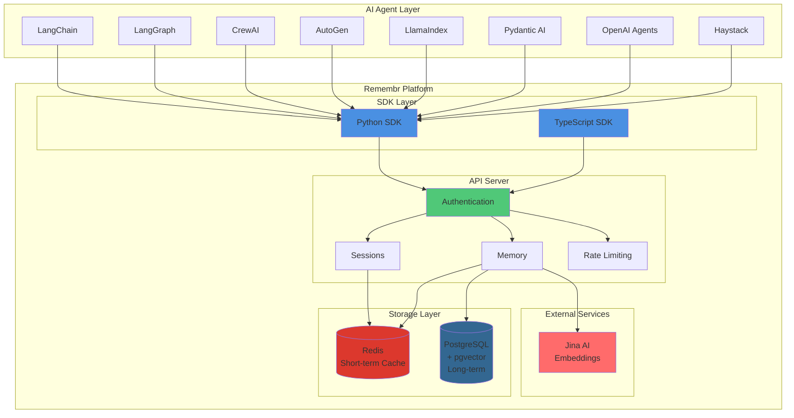
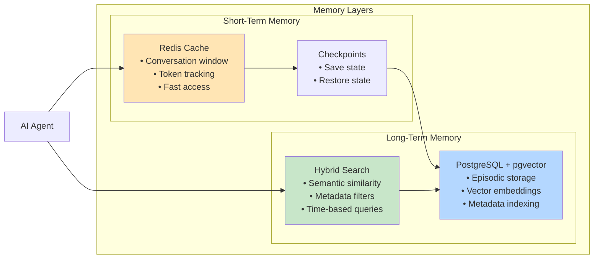

<div align="center">


**Persistent Memory Infrastructure for AI Agents**

[](https://opensource.org/licenses/MIT)
[](https://www.python.org/downloads/)
[](https://www.typescriptlang.org/)
[](https://github.com/emartai/remembr)
[](./FINAL_RESULTS.md)

[Quick Start](#quick-start) • [Documentation](#documentation) • [Architecture](#architecture) • [Adapters](#framework-adapters) • [API Reference](docs/api-reference.md)

</div>

---

## Overview

Remembr is a production-ready memory infrastructure that gives AI agents persistent, searchable memory across conversations. Built for scale, security, and multi-framework compatibility.

### Why Remembr?

Modern AI agents need memory that:
- **Persists** across sessions and deployments
- **Scales** from prototype to production
- **Searches** semantically with hybrid retrieval
- **Isolates** data with multi-tenant security
- **Complies** with GDPR and data regulations
- **Integrates** seamlessly with existing frameworks

Remembr solves this with a unified API, battle-tested adapters for 8 major frameworks, and enterprise-grade infrastructure.

---

## Key Features

✅ **8 Framework Adapters** - LangChain, LangGraph, CrewAI, AutoGen, LlamaIndex, Pydantic AI, OpenAI Agents, Haystack  
✅ **Hybrid Search** - Semantic (Jina embeddings) + metadata filtering  
✅ **Multi-Tenant Isolation** - Org → Team → User → Agent → Session scoping  
✅ **Short + Long-Term Memory** - Redis cache + PostgreSQL episodic storage  
✅ **Checkpoint & Restore** - Save and restore conversation state  
✅ **GDPR Compliant** - Targeted deletion APIs for right-to-erasure  
✅ **Production Ready** - Rate limiting, auth, monitoring, and observability  
✅ **Self-Hostable** - Deploy on Railway, Docker, or Kubernetes  

---

## Architecture

### High-Level System Architecture



### Memory Architecture



### Multi-Tenant Scoping

```
Organization (org_id)
└── Team (team_id)
    └── User (user_id)
        └── Agent (agent_id)
            └── Session (session_id)
                ├── Short-term window (Redis)
                └── Episodic memories (PostgreSQL)
```

**Scope Isolation:**
- All API requests are scoped to authenticated context
- Agent-level keys cannot access sibling agents
- Org-level keys enable compliance operations
- Row-level security enforced at database layer

---

## Quick Start

### Installation

**Python:**
```bash
pip install remembr
```

**TypeScript:**
```bash
npm install @remembr/sdk
```

### Basic Usage (Python)

```python
import asyncio
from remembr import RemembrClient

async def main():
    # Initialize client
    client = RemembrClient(
        api_key="your_api_key",
        base_url="https://api.remembr.dev/v1"
    )
    
    # Create a session
    session = await client.create_session(
        metadata={"user": "demo", "context": "support"}
    )
    
    # Store memories
    await client.store(
        content="User prefers email notifications on Fridays",
        role="user",
        session_id=session.session_id,
        tags=["preference", "notification"]
    )
    
    # Search memories
    results = await client.search(
        query="When should I send notifications?",
        session_id=session.session_id,
        limit=5,
        mode="hybrid"
    )
    
    for memory in results.results:
        print(f"[{memory.role}] {memory.content} (score: {memory.score:.3f})")
    
    await client.aclose()

asyncio.run(main())
```

### Basic Usage (TypeScript)

```typescript
import { RemembrClient } from '@remembr/sdk';

async function main() {
  const client = new RemembrClient({
    apiKey: process.env.REMEMBR_API_KEY!,
    baseUrl: 'https://api.remembr.dev/v1'
  });

  // Create session
  const session = await client.createSession({
    metadata: { user: 'demo', context: 'support' }
  });

  // Store memory
  await client.store({
    content: 'User prefers dark mode interface',
    role: 'user',
    sessionId: session.session_id,
    tags: ['preference', 'ui']
  });

  // Search memories
  const results = await client.search({
    query: 'What are the user UI preferences?',
    sessionId: session.session_id,
    limit: 5,
    mode: 'hybrid'
  });

  results.results.forEach(memory => {
    console.log(`[${memory.role}] ${memory.content} (score: ${memory.score})`);
  });
}

main();
```

---

## Framework Adapters

Remembr provides native adapters for 8 major AI frameworks. All adapters are **production-ready** and **fully tested**.

| Framework | Pattern | Best For | Status | Install |
|-----------|---------|----------|--------|---------|
| **LangChain** | `BaseMemory` drop-in | Existing chains/agents | ✅ Tested | `pip install remembr-langchain` |
| **LangGraph** | Graph state + checkpointer | Stateful workflows | ✅ Tested | `pip install remembr-langgraph` |
| **CrewAI** | Shared crew memory | Multi-agent collaboration | ✅ Tested | `pip install remembr-crewai` |
| **AutoGen** | Agent hook injection | ConversableAgent memory | ✅ Tested | `pip install remembr-autogen` |
| **LlamaIndex** | Chat store + buffer | RAG + query engines | ✅ Tested | `pip install remembr-llamaindex` |
| **Pydantic AI** | Dependency injection | Structured agents | ✅ Tested | `pip install remembr-pydantic-ai` |
| **OpenAI Agents** | Function tools | Swarm/handoff patterns | ✅ Tested | `pip install remembr-openai-agents` |
| **Haystack** | Pipeline components | RAG orchestration | ✅ Tested | `pip install remembr-haystack` |

### Adapter Example (LangChain)

```python
from langchain.chains import ConversationChain
from langchain_openai import ChatOpenAI
from adapters.langchain import RemembrMemory

# Initialize Remembr memory
memory = RemembrMemory(
    api_key="your_api_key",
    session_id="session_123"
)

# Use with LangChain
chain = ConversationChain(
    llm=ChatOpenAI(),
    memory=memory
)

response = chain.predict(input="Remember: I prefer Python over JavaScript")
print(response)
```

📚 **[View all adapter guides →](docs/adapters/)**

---

## Documentation

### Getting Started
- [Quickstart Guide](docs/quickstart.md) - Get running in 5 minutes
- [Core Concepts](docs/concepts.md) - Memory layers, scoping, hybrid search
- [API Reference](docs/api-reference.md) - Complete REST API documentation

### Framework Integration
- [LangChain Adapter](docs/adapters/langchain.md)
- [LangGraph Adapter](docs/adapters/langgraph.md)
- [CrewAI Adapter](docs/adapters/crewai.md)
- [AutoGen Adapter](docs/adapters/autogen.md)
- [LlamaIndex Adapter](docs/adapters/llamaindex.md)
- [Pydantic AI Adapter](docs/adapters/pydantic_ai.md)
- [OpenAI Agents Adapter](docs/adapters/openai_agents.md)
- [Haystack Adapter](docs/adapters/haystack.md)

### Deployment & Operations
- [Self-Hosted Setup](docs/self-hosted.md) - Docker, Railway, Kubernetes
- [Deployment Guide](DEPLOYMENT.md) - Production deployment patterns
- [Architecture Deep Dive](ARCHITECTURE.md) - Technical architecture details
- [Security & Compliance](docs/security.md) - GDPR, encryption, auth

---

## API Overview

### Core Endpoints

**Authentication**
```bash
POST /api/v1/auth/register  # Create account
POST /api/v1/auth/login     # Get JWT token
POST /api/v1/auth/refresh   # Refresh token
```

**Sessions**
```bash
POST   /api/v1/sessions                    # Create session
GET    /api/v1/sessions                    # List sessions
GET    /api/v1/sessions/{id}               # Get session details
POST   /api/v1/sessions/{id}/checkpoint    # Save checkpoint
POST   /api/v1/sessions/{id}/restore       # Restore from checkpoint
```

**Memory**
```bash
POST   /api/v1/memory          # Store memory
POST   /api/v1/memory/search   # Search memories (hybrid)
GET    /api/v1/memory/diff     # Get new memories in time range
DELETE /api/v1/memory/{id}     # Delete specific memory
```

**Management**
```bash
POST   /api/v1/api-keys        # Create API key
GET    /api/v1/api-keys        # List API keys
DELETE /api/v1/api-keys/{id}   # Revoke API key
GET    /api/v1/health          # Health check
```

📖 **[Full API Reference →](docs/api-reference.md)**

---

## Deployment

### Quick Deploy (Railway)

[](https://railway.app/template/remembr)

See [RAILWAY_QUICKSTART.md](RAILWAY_QUICKSTART.md) for detailed instructions.

### Docker Compose

```bash
# Clone repository
git clone https://github.com/emartai/remembr.git
cd remembr

# Configure environment
cp .env.example .env
# Edit .env with your settings

# Start services
docker-compose up -d

# Run migrations
docker-compose exec server alembic upgrade head
```

### Self-Hosted Options

- **Docker** - Single container deployment
- **Docker Compose** - Multi-container with Redis + PostgreSQL
- **Railway** - One-click deployment
- **Kubernetes** - Production-grade orchestration

📦 **[Deployment Guide →](DEPLOYMENT.md)**

---

## Performance & Scale

### Benchmarks

- **Latency**: < 50ms (p95) for memory storage
- **Search**: < 200ms (p95) for hybrid search with 10K+ memories
- **Throughput**: 1000+ req/s per instance
- **Storage**: Tested with 1M+ episodic memories per session

### Production Features

- ✅ Rate limiting (Redis-backed)
- ✅ JWT authentication with refresh tokens
- ✅ Row-level security (RLS) in PostgreSQL
- ✅ Connection pooling and query optimization
- ✅ Structured logging with request IDs
- ✅ Health checks and monitoring endpoints
- ✅ Graceful error handling and retries

---

## Repository Structure

```
remembr/
├── adapters/              # Framework adapters (8 frameworks)
│   ├── langchain/
│   ├── langgraph/
│   ├── crewai/
│   ├── autogen/
│   ├── llamaindex/
│   ├── pydantic_ai/
│   ├── openai_agents/
│   └── haystack/
├── server/                # FastAPI server
│   ├── app/
│   │   ├── api/          # REST endpoints
│   │   ├── db/           # Database models
│   │   ├── services/     # Business logic
│   │   ├── repositories/ # Data access
│   │   └── middleware/   # Auth, rate limiting
│   ├── alembic/          # Database migrations
│   └── tests/            # Server tests
├── sdk/                   # Client SDKs
│   ├── python/           # Python SDK
│   └── typescript/       # TypeScript SDK
├── docs/                  # Documentation
├── tests/                 # End-to-end tests
└── docker-compose.yml     # Local development
```

---

## Contributing

We welcome contributions! Please see [CONTRIBUTING.md](CONTRIBUTING.md) for guidelines.

### Development Setup

```bash
# Clone repository
git clone https://github.com/emartai/remembr.git
cd remembr

# Create virtual environment
python -m venv .venv
source .venv/bin/activate  # or .venv\Scripts\activate on Windows

# Install dependencies
pip install -r server/requirements.txt
pip install -e sdk/python

# Start development server
cd server
uvicorn app.main:app --reload

# Run tests
pytest tests/ -v
```

### Running Tests

```bash
# Unit tests
pytest server/tests/ -v

# Integration tests
pytest tests/e2e/ -v

# Adapter tests
python test_8_adapters_final.py
```

---

## Security

- **Authentication**: JWT tokens with refresh mechanism
- **Authorization**: Multi-tenant row-level security (RLS)
- **Encryption**: TLS in transit, at-rest encryption for PostgreSQL
- **Rate Limiting**: Redis-backed rate limiting per API key
- **GDPR Compliance**: Targeted deletion APIs for right-to-erasure
- **Audit Logging**: Request IDs and structured logs

🔒 **[Security Documentation →](docs/security.md)**

---

## License

This project is licensed under the MIT License - see the [LICENSE](LICENSE) file for details.

---

## Support & Community

- **GitHub Issues**: [Report bugs or request features](https://github.com/emartai/remembr/issues)
- **Documentation**: [docs/](docs/)
- **Email**: [nwangumaemmanuel29@gmail.com](mailto:nwangumaemmanuel29@gmail.com)

---

## Acknowledgments

Built with:
- [FastAPI](https://fastapi.tiangolo.com/) - Modern Python web framework
- [PostgreSQL](https://www.postgresql.org/) + [pgvector](https://github.com/pgvector/pgvector) - Vector database
- [Redis](https://redis.io/) - In-memory cache
- [Jina AI](https://jina.ai/) - Embedding generation
- [Alembic](https://alembic.sqlalchemy.org/) - Database migrations

---

<div align="center">

**Made with ❤️ by [Emmanuel Nwanguma](https://linkedin.com/in/nwangumaemmanuel)**

[⭐ Star us on GitHub](https://github.com/emartai/remembr) • [📖 Read the Docs](docs/) • [🚀 Deploy Now](DEPLOYMENT.md)

</div>
